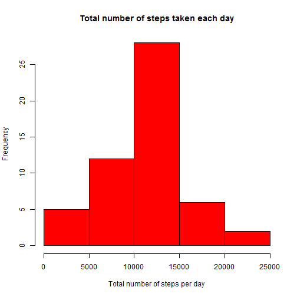
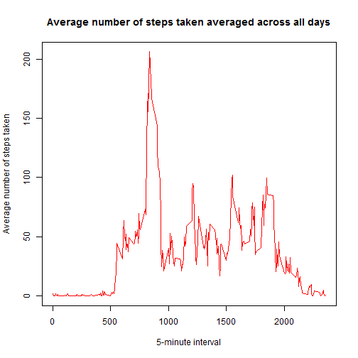
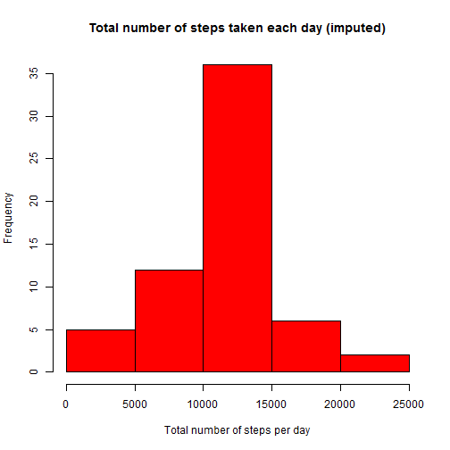
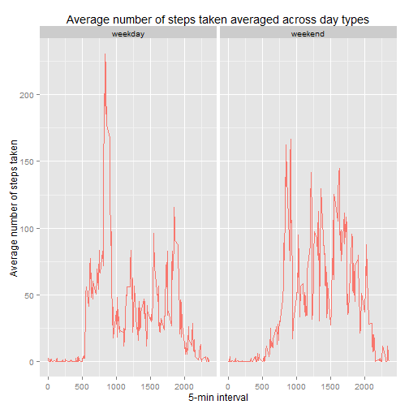

      It is now possible to collect a large amount of data about personal movement using activity monitoring devices such as a Fitbit, Nike Fuelband, or Jawbone Up. These type of devices are part of the “quantified self” movement – a group of enthusiasts who take measurements about themselves regularly to improve their health, to find patterns in their behavior, or because they are tech geeks. But these data remain under-utilized both because the raw data are hard to obtain and there is a lack of statistical methods and software for processing and interpreting the data.

      This assignment makes use of data from a personal activity monitoring device. This device collects data at 5 minute intervals through out the day. The data consists of two months of data from an anonymous individual collected during the months of October and November, 2012 and include 

##Data
1. Load the [dataset](https://d396qusza40orc.cloudfront.net/repdata%2Fdata%2Factivity.zip) downloaded from the course web site:

```r
activity = read.csv("C:/Users/gturowski/Desktop/R/activity.csv")
```
2. Process/transform the data (if necessary) into a format suitable for your analysis

```r
Steps <- aggregate(steps ~ date, data = activity, sum, na.rm = TRUE)
```
##What is mean total number of steps taken per day?

```r
hist(Steps$steps, col=2,main = "Total number of steps taken each day",xlab="Total number of steps per day")
```

 

1. The mean of the total number of steps taken per day is: **10766.19**

```r
mean(Steps$steps)
```

```
## [1] 10766.19
```
2. The median of the total number of steps taken per day is: **10765**

```r
median(Steps$steps)
```

```
## [1] 10765
```
##What is the average daily activity pattern?
1. Make a time series plot of the 5-minute interval (x-axis) and the average number of steps taken, averaged across all days (y-axis)

```r
Steps_Interval <- aggregate(steps ~ interval, data = activity, mean, na.rm = TRUE)
```

```r
plot(Steps_Interval$interval, Steps_Interval$steps, 
     type='l', col=2, 
     main="Average number of steps taken averaged across all days", 
     xlab="5-minute interval", ylab="Average number of steps taken")
```

 

2. Which 5-minute interval, on average across all the days in the dataset, contains the maximum number of steps?

```r
Steps_Interval[Steps_Interval$steps==max(Steps_Interval$steps),]
```

```
##     interval    steps
## 104      835 206.1698
```
Interval **835** contains the maximum average number of steps **(206.1698)**.

##Imputing missing values
Note that there are a number of days/intervals where there are missing values (coded as NA). The presence of missing days may introduce bias into some calculations or summaries of the data.

1. Calculate and report the total number of missing values in the dataset (i.e. the total number of rows with NAs)

```r
sum(is.na(activity$steps))
```

```
## [1] 2304
```
There is a total number of **2304** missing values in the dataset.

2. Devise a strategy for filling in all of the missing values in the dataset. The strategy does not need to be sophisticated. For example, you could use the mean/median for that day, or the mean for that 5-minute interval, etc. Create a new dataset that is equal to the original dataset but with the missing data filled in.

*I will replace all missing values with mean for respective 5-minute interval, for that I can use the existing Steps_Interval data frame*


```r
activity_noNAs<-activity
for(i in 1:nrow(activity_noNAs)){
      if(is.na(activity_noNAs$steps[i])){
            val <- Steps_Interval[Steps_Interval$interval %in% activity_noNAs$interval[i],]
            activity_noNAs$steps[i] <- val$steps
      }
}
```

3. Make a histogram of the total number of steps taken each day


```r
Steps_noNA <- aggregate(steps ~ date, data = activity_noNAs, sum, na.rm = TRUE)
```


```r
hist(Steps_noNA$steps, col=2,main = "Total number of steps taken each day (imputed)",xlab="Total number of steps per day")
```

 
Calculate and report the mean and median total number of steps taken per day. Do these values differ from the estimates from the first part of the assignment? What is the impact of imputing missing data on the estimates of the total daily number of steps?

1. The mean of the total number of steps taken per day is: **10766.19**

```r
mean(Steps_noNA$steps)
```

```
## [1] 10766.19
```
2. The median of the total number of steps taken per day is: **10766.19**

```r
median(Steps_noNA$steps)
```

```
## [1] 10766.19
```

*Mean remained the same because using mean of intervals for missing values does not change the total mean for a single interval.The value of median is slightly different because it completely depends on where the NAs occured.*

##Are there differences in activity patterns between weekdays and weekends?
1. Create a new factor variable in the dataset with two levels – “weekday” and “weekend” indicating whether a given date is a weekday or weekend day.


```r
activity_noNAs$date <- as.Date(activity_noNAs$date, "%Y-%m-%d")
activity_noNAs$weekday <- weekdays(activity_noNAs$date)
activity_noNAs$weekday_type <- c("weekday_type")
for (i in 1:nrow(activity_noNAs)){
      if (activity_noNAs$weekday[i] == "Saturday" || activity_noNAs$weekday[i] == "Sunday"){
            activity_noNAs$weekday_type[i] <- "weekend"
      }
      else activity_noNAs$weekday_type[i] <- "weekday"
}
activity_noNAs$weekday_type<-as.factor(activity_noNAs$weekday_type)
```


2. Make a panel plot containing a time series plot (i.e. type = "l") of the 5-minute interval (x-axis) and the average number of steps taken, averaged across all weekday days or weekend days (y-axis).


```r
Steps_Interval_Imputed <- aggregate(steps ~ interval+weekday_type, activity_noNAs, mean)
library(ggplot2)
print_plot<-qplot(interval, steps, data=Steps_Interval_Imputed, color="red",geom=c("line"), xlab="5-min interval", ylab="Average number of steps taken", main="Average number of steps taken averaged across day types") 
print_plot <- print_plot + facet_wrap(~ weekday_type)
print_plot <- print_plot + theme(legend.position = "none")
print(print_plot)
```

 


